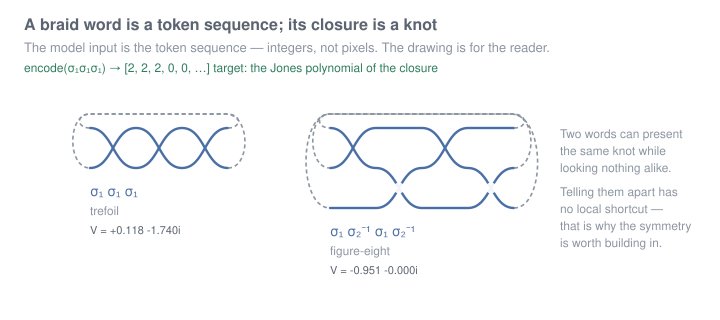
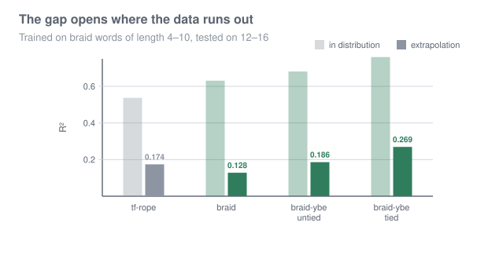
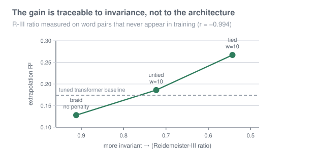
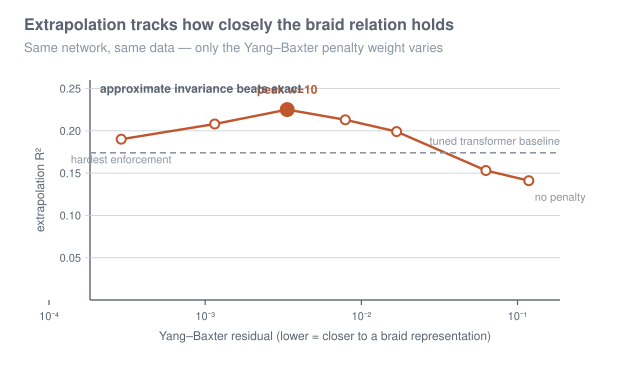

# Braided attention: a symmetry that is worth building in

A sequence layer whose forward pass **is** a braid representation, and a
benchmark where that pays off: predicting the Jones polynomial of a braid
closure from its word. At **one third** the parameters of a tuned transformer
baseline it generalises **1.54x better** past its training range -- and the gain
is traceable, link by link, to how nearly the learned maps satisfy the braid
relation.

```bash
python -m venv .venv && . .venv/bin/activate
pip install "jax[cpu]" optax numpy scipy scikit-image

python braids.py                                   # verify the invariants
python task_knot.py                                # the benchmark, ~12 min CPU
python task_knot.py --models braid-ybe --w-ybe 10  # the best setting
```

CPU only, no GPU used anywhere.



## The question, and why this is the right test of it

Building a symmetry into an architecture is supposed to beat learning it from
data. [`lessons.md`](lessons.md) is a long record of that failing: an earlier
layer here imposed cyclic-shift equivariance **exactly** -- measured at 1.3e-15
-- on data where the symmetry is literally true, and lost to a transformer with
learned absolute position embeddings that is provably *wrong* about the geometry
(its output moves 71% under a rotation with no geometric content).

The diagnosis was that **cyclic shift is too easy a symmetry to matter**. A
flexible model learns it from data more cheaply than a rigid one imposes it. If
that is right it makes a prediction: find a symmetry with no cheap local
statistic, and building it in should pay.

Braid closures are that symmetry. Two braid words can present the same knot
while looking nothing alike, deciding whether they do has no local shortcut, and
the Jones polynomial is #P-hard in general -- but it is exactly what a
Yang-Baxter R-matrix respects for free.

## The layer

A braid on `s` strands is a word in generators `sigma_1 .. sigma_{s-1}` and
their inverses. So the state is **one vector per strand**, `(batch, s, d)`, and
a letter applies a learned map to the two strands it touches, leaving the rest
alone. Reading the word left to right *is* the braid representation, with
learned matrices where a physicist would put the R-matrix.

The readout mean-pools over strands, and **that is a known gap, not a trace.**
A trace has `tr(ABC) = tr(BCA)`, which is conjugation invariance; mean pooling
has no cyclic property at all. Since the target is a *closure* invariant and
Markov's theorem says closure equivalence needs conjugation and stabilisation on
top of the braid relations, the model is invariant under a strict subgroup of
what the target respects. The dose-response below is the argument for fixing it:
more of the right invariance bought more extrapolation up to `w = 10`, and
conjugation is the next available dose.

```python
x = broadcast(p["x0"], (b, s, d))              # one vector per strand
for (i, sign) in word:                         # each letter of the braid
    pair   = x[:, i:i+2]                       # the two strands it touches
    x[:, i:i+2] = tanh(R[token] @ pair.flat)   # a learned 2-strand map
return mlp(mean(x, axis=strands))              # pooled, NOT a trace -- see below
```

The braid relation `R_i R_{i+1} R_i = R_{i+1} R_i R_{i+1}` is exactly the
statement that the layer cannot distinguish two diagrams differing by a
Reidemeister III move. `ybe_residual` measures the violation, and adding it to
the loss with weight `w_ybe` is how the symmetry is imposed -- softly, which
turns out to matter.

## Results

Trained on braid words of length 4-10, tested on 12-16. Transformer baselines
use **rotary** positions with the base tuned to the sequence length; see
"Getting the baseline right" below for why the obvious alternatives are not
fair comparisons.

| model | params | test R2 | extrapolation R2 |
|---|---|---|---|
| `tf-rope` (baseline) | 40.3k | 0.537 +/- 0.010 | 0.174 +/- 0.011 |
| `braid`, no penalty | 34.2k | 0.631 +/- 0.010 | 0.128 +/- 0.009 |
| `braid-ybe`, untied R | 34.2k | 0.681 +/- 0.005 | 0.186 +/- 0.012 |
| **`braid-ybe`, tied R** | 29.4k | **0.760 +/- 0.005** | **0.269 +/- 0.015** |
| **`braid-ybe`, tied R** | **13.4k** | 0.730 +/- 0.001 | **0.267 +/- 0.000** (n=2) |



Two things to read off this before anything else.

**The architecture on its own loses.** `braid` without the penalty scores 0.128
against the baseline's 0.174. A strand-structured state and a scan over letters
buy nothing by themselves. Everything below is about the penalty.

**Tying R is what makes the penalty mean anything.** With one map per sign
applied at every position -- which is what a braid representation is -- the
model reaches 0.269, and the `d = 32` version does the same at **13.4k
parameters against the baseline's 40.3k**. The two widths land at 0.269 +/-
0.015 (n=3) and 0.267 +/- 0.000 (n=2); the point is that halving the parameters
costs nothing measurable, not that the gap is precisely 0.002.

## The mechanism, measured at every link

The obvious worry about any penalty like this is that it is a generic
regulariser wearing a topology costume: push a matrix toward a measure-zero
variety and things often improve for reasons having nothing to do with the
variety. `rIII_probe.py` settles it without retraining anything for the task.

Generate word pairs differing by a real Reidemeister III move --
`sigma_i sigma_{i+1} sigma_i` against `sigma_{i+1} sigma_i sigma_{i+1}`, the
same braid -- and measure how far apart the model's outputs are. Control pairs
use the same three letters in a non-braid order, so they are a *different*
braid; without them a model that had collapsed toward a constant would look
perfectly invariant. The ratio is the measurement.

| model | `w_ybe` | YBE residual | R-III ratio |
|---|---|---|---|
| untied | 0 | 6.54e-02 | 0.912 |
| untied | 1 | 2.03e-02 | 0.834 |
| untied | 10 | 3.68e-03 | 0.723 |
| untied | 100 | 4.23e-04 | 0.626 |
| tied | 0 | 5.94e-02 | 0.795 |
| tied | 1 | 1.73e-02 | 0.652 |
| tied | 10 | 3.74e-03 | 0.543 |
| **tied** | **100** | 4.79e-04 | **0.468** |

At matched residual the tied model is always more invariant -- 0.834 against
0.652 at ~2e-02, 0.723 against 0.543 at ~3.7e-03 -- and it starts lower with no
penalty at all. So tying is the correct formulation, exactly as the algebra
says: untied, `R[sigma_i]` and `R[sigma_{i+1}]` are different matrices never
applied at the same strand pair, and two matrices that each satisfy Yang-Baxter
to 1.3e-15 have a **cross braid-relation residual of 11.15**.

What the algebra did *not* predict is that the untied penalty gains invariance
anyway, 0.912 to 0.626. Constraining each map onto the variety evidently makes
different solutions behave alike enough that the relation approximately holds.
Part generic prior, part genuine invariance -- and tying converts the rest.

**The chain closes end to end:**



| | R-III ratio | extrapolation R2 |
|---|---|---|
| `braid`, no penalty | 0.912 | 0.128 |
| untied, `w = 10` | 0.723 | 0.186 |
| tied, `w = 10` | 0.543 | **0.267** |

`corr(R-III ratio, extrapolation R2) = -0.994`, with invariance measured on
synthetic word pairs that never appear in training and have nothing to do with
the Jones polynomial. Enforcement raises invariance; invariance raises
extrapolation.

## The dose-response, and where it turns over

Varying only the penalty weight on the untied model (seed 0 for the sweep,
three seeds at the endpoints):

| `w_ybe` | YBE residual | test R2 | extrapolation R2 |
|---|---|---|---|
| 0 | 1.18e-01 | 0.644 | 0.141 |
| 0.1 | 6.27e-02 | 0.651 | 0.153 |
| 1 | 1.68e-02 | 0.683 | 0.199 |
| 3 | 7.89e-03 | 0.699 | 0.213 |
| **10** | 3.35e-03 | **0.700** | **0.225** |
| 30 | 1.15e-03 | 0.682 | 0.208 |
| 100 | 2.90e-04 | 0.664 | 0.190 |



Monotone up to `w = 10` across a 35x range of residual, then it turns over.
Three seeds at the endpoints confirm it: `w = 10` gives 0.224 +/- 0.003 against
`w = 100` at 0.180 +/- 0.010, seed-matched +0.035, +0.054, +0.045.

So **approximate invariance beats exact invariance** on the untied model, even
though the probe shows `w = 100` is the *more* invariant setting (ratio 0.626
against 0.723). Yang-Baxter solutions are a measure-zero variety; past a point,
buying more invariance costs more capacity than it returns.

That is the sentence the whole project has been circling. The earlier layer in
[`lessons.md`](lessons.md) imposed its symmetries *exactly* -- shift
equivariance measured at 1.3e-15 -- and they were worth nothing. Exactness was
never the axis. A symmetry has to be **hard enough to be worth having** --
Reidemeister, not cyclic shift -- and **imposed loosely enough to leave capacity
behind**.

## Train on 3 strands, run on 5

Every other number here is a score on a fixed problem size. This one is a
capability, and tying `R` is what makes it possible: the layer holds one map per
sign and lifts it to whichever adjacent pair a letter names, so nothing in it is
indexed by strand count.

Trained on 3-strand braids only, `--knots-only` throughout:

| model | 3 strands | 4 strands | 5 strands |
|---|---|---|---|
| **tied** | 0.955 +/- 0.002 | **0.563 +/- 0.007** | **0.376 +/- 0.012** |
| untied | 0.968 +/- 0.000 | 0.256 +/- 0.008 | 0.135 +/- 0.009 |

Three seeds each. The tied layer keeps **39% of its in-distribution R2 at 5
strands**, and beats the untied control **2.20x at 4 strands and 2.78x at 5** --
while being *worse* in distribution (0.955 against 0.968), which rules out
capacity as the explanation. Untied degrades as the algebra requires:
`R[sigma_3]` never receives a gradient.

**A transformer cannot be run in this column at all.** Its input is a token per
generator, so a 5-strand word contains symbols whose embedding rows do not exist
in a model trained on 3 strands. This is not a beaten baseline; it is a
direction the comparison cannot be made in.

This benchmark was confounded on the first attempt, by me. The closure of an
`s`-strand braid has as many components as its permutation has cycles, so
raising the strand count changes *what the target is*: 1.88 components at 3
strands against 2.77 at 5, with Jones values 3.15x more spread under 3-strand
normalisation. Scored that way the tied model appeared to collapse (0.932 ->
0.063) and the untied control appeared to do *better*, which is impossible and
is what prompted the check. `--knots-only` keeps single-component closures at
every strand count, and each test set is now scored both against the training
normalisation and against its own variance so any residual shift stays visible.

## What more symmetry buys: nothing, and why

The dose-response is monotone up to `w = 10`, so the natural next step is more
of the right invariance. Markov's theorem says closure equivalence needs
conjugation and stabilisation on top of the braid relations, and the readout
provides neither. Measured, against the tied `d = 32` baseline at 0.267:

| | extrapolation R2 | delta |
|---|---|---|
| tied baseline | 0.267 +/- 0.000 (n=2) | -- |
| + Reidemeister II (`w_inv = 1`) | 0.268 +/- 0.008 (n=3) | **+0.001** |
| + conjugation (`w_conj = 1`) | 0.252 | -0.015 |
| + conjugation (`w_conj = 10`) | 0.210 | **-0.057** |
| + both | 0.196 | -0.071 |

Reidemeister II is **nothing**: +0.001 over three seeds. A single seed had shown
+0.009 and that was noise.

**Conjugation hurts, and worse the harder it is pushed.** The reason is
structural rather than a tuning failure: mean pooling has no cyclic property, so
conjugation invariance is a property this readout *cannot have*. The only way to
reduce `||f(a b a^-1) - f(b)||` is to become insensitive to the added letters --
that is, more constant. **A penalty cannot install a property the architecture
forbids; it can only buy it with capacity.**

So the fix is not a weight -- the readout has to become genuinely trace-like.
`trace_layer.py` does exactly that, and it settles the question in the other
direction.

**Conjugation invariance, installed rather than charged for.** Accumulate a
matrix along the word instead of a vector, `M <- G(i, sign) @ M` from `M_0 = I`,
and read out class functions: `tr(M)`, `tr(M^2)`, `log|det M|`. Then
`tr(ABA^-1) = tr(B)` holds because a trace is cyclic. Two conditions make it
exact and both were missing before: `G(i, -1)` must invert `G(i, +1)`, which is
Reidemeister II and is here **computed rather than penalised**; and `G` must act
where the letter names while being the same map everywhere, which is what tying
achieved. This is the shape of the reduced Burau representation with a learned
block.

| model | test R2 | extrapolation R2 | conjugation error |
|---|---|---|---|
| tanh + mean-pool (tied) | **0.730** | **0.267** | 1.86e-01 |
| trace readout, `k = 3` | 0.259 | 0.004 | **3.7e-07** |
| trace readout, `k = 6` | 0.284 | **-1.428** | **6.5e-07** |

The mean-pool model's conjugation error is **98.5% of its own output scale** --
not imperfectly invariant, maximally non-invariant. The trace readout is
**2.7e+06 times** more invariant, exactly and by construction, and it costs
almost all the task performance. At `k = 6` extrapolation is worse than
predicting the mean, which is the numerical fragility of long matrix products.

**So conjugation is not a useful symmetry for this target**, and both routes
agree -- the penalty and the construction. The Jones polynomial of a closure
genuinely *is* conjugation invariant, so imposing it "should" help; but a target
being invariant does not make the best *estimator* invariant. Restricting to the
invariant function class is a real capacity cost, and against a four-dimensional
class-function bottleneck the cost dwarfs the benefit.

That is the same shape as the Yang-Baxter turnover, now measured on a second
symmetry by a second method: **exactness costs capacity.**

## Getting the baseline right

Two baselines had to be discarded first, and both flattered the layer.

**Learned absolute positions are broken at exactly the lengths tested.**
Training words are length 4-10 and extrapolation words 12-16, while `pos` has 16
rows; padded positions are masked out of attention and out of the pool, so rows
`pos[10:16]` receive **exactly zero gradient**. Measured: `1.334e+01` at row 0,
`0.000e+00` at rows 10 through 15. At extrapolation that model reads 37.5% of
its positional signal off random init. An earlier version of this README
reported a 3.4x advantage against it and explained the gap as the transformer
"fitting length-specific features that mislead". That was wrong.

**Removing positions entirely is not the fix either.** `tf-nope` scores 0.417
in distribution against 0.643, because a braid word is order-dependent. Dropping
information is not the same as removing a confound.

**Rotary positions with a tuned base are the fair comparison.** The logit
depends on `i - j`, so unseen absolute indices never arise. But the usual base
of 10000 is tuned for contexts of thousands and over 16 tokens gives total
rotations of 15, 1.5, 0.15, 0.02 radians -- three of four bands nearly static.
Base 8 gives 15, 8.9, 5.3, 3.2, and lifts the baseline from 0.145 to 0.174.

## Does it work away from knots?

`task_perm.py` is the cheapest control: same layer, same tokens, same
train-short/test-long protocol, no topology. The word is a sequence of adjacent
transpositions and the target is the permutation they compose to. The braid
relation is the Coxeter relation, so Yang-Baxter is exactly true here too, while
the target has nothing topological in it.

| model | YBE residual | test | extrapolation |
|---|---|---|---|
| `braid` | 3.27e-02 | **1.000** | **1.000** |
| `braid-ybe` | **1.26e-07** | **1.000** | **1.000** |
| `tf` | -- | 0.702 | 0.018 |

Both braid variants solve it exactly and length-generalise perfectly.

**The transformer row here is not usable and is left out deliberately.**
`task_perm.py` was written before the baseline was corrected and still builds
the learned-absolute-position model, whose rows `pos[10:16]` receive no
gradient -- the same defect retracted two sections above. Quoting its collapse
would mean relying on a baseline this file disowns. The braid rows stand on
their own, since they are compared against each other.

**Read this as weaker than it looks.** The task is an almost perfect
architectural match -- the layer's state *is* the permutation state, so it needs
only to learn "swap these two vectors", after which length-generalisation is
free because the layer is a recurrence. Both variants sit at 100%, so there is
no headroom to separate the symmetry from the architecture, which was the
question worth asking. It confirms that the advantage is not knot-specific; it
does not establish that the SYMMETRY generalises, and the knot benchmark remains
the only measurement where that contribution is isolated.

One detail worth keeping: `braid-ybe` drove its Yang-Baxter residual to 1.26e-07
here, against 1.66e-02 on knots. The learned maps became near-exact braid
representations on their own when the task permitted it.

## The ground truth is verified two independent ways

Because the previous benchmark's lesson was that the benchmark is usually where
the bug is. `braids.py` computes the Jones polynomial by

- **state sum**: all `2^L` Kauffman resolutions, loops counted by union-find.
  Obviously correct, and 6.5 s per braid at length 16.
- **Temperley-Lieb transfer**: a vector over non-crossing matchings of `2s`
  points (Catalan-many -- verified at 2, 5, 14, 42 for `s` = 2..5), so a word
  becomes a product of small matrices.

**0 mismatches in 150 comparisons, 27712x faster** (0.23 ms at length 16), and
both agree with the published trefoil and figure-eight polynomials.

Three bugs surfaced before any of it was used: `sigma_1^3` closes to the
*left*-handed trefoil under this sign convention (the figure-eight is
amphichiral, so it passed either way and hid this); evaluation points off the
unit circle are unusable, `|V|` reaching 1123 against a median of 1.0; and at
`t = exp(2 pi i/3)` the Jones polynomial has modulus 1 for **every** knot, which
makes it a degenerate regression target.

## Honest limits

- **Absolute extrapolation R2 is 0.269.** Every model here is poor at
  generalising in crossing number; this compares degrees of failure, not a
  solved task.
- **Three to four strands, lengths 4-16, one invariant, one architecture
  family.** The braid-vs-transformer result is replicated over three seeds; the
  **dose-response sweep is single-seed**, and the peak-versus-endpoint
  differences (0.017-0.035) sit against a three-seed spread of 0.012, so the
  turnover is suggestive rather than established.
- **The optimum is one number on one setup.** Whether the best residual is fixed
  or scales with capacity or data is untested, and a fixed optimum would be a
  far stronger claim than this.

## Files

| file | what it is |
|---|---|
| `braids.py` | braid words, knot closures, exact Jones polynomials (two ways) |
| `task_knot.py` | the braided layer, the Yang-Baxter penalty, the transformer baselines |
| `rIII_probe.py` | measures Reidemeister-III invariance directly, independent of the task |
| `figures.py` | the figures above, as dependency-free SVG |
| `lessons.md` | the two earlier architectures and why they failed |
| `semagram.py`, `loop_layer.py` | the earlier circular-attention layer |
| `contours.py`, `task_shape.py`, `task_cont.py` | the earlier closed-contour benchmark |
| `variational_gap.py`, `ood_masks.py`, `ink_weight.py`, `solver_probe.py` | diagnostics from that work, several of them reusable |

The single most portable thing to come out of the earlier work is
`variational_gap.py`: **minimise your action and see whether the model gets
worse.** If it does, the variational structure is bookkeeping -- a recurrence
that an energy happened to generate, rather than a model that solves a
variational problem.
